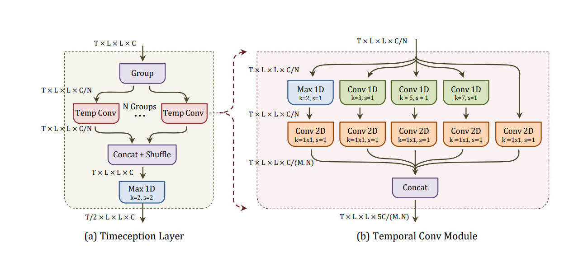

## Timeception for Complex Action Recognition
This code repository is the implementation for the paper [Timeception for Complex Action Recognition](https://arxiv.org/abs/1812.01289).
We provide the implementation for 3 different libraries: `keras`, `tensorflow` and `pytorch`.



### Citation
Please consider citing this work using this BibTeX entry
```bibtex
@inproceedings{hussein2018timeception,
  title     = {Timeception for Complex Action Recognition},
  author    = {Hussein, Noureldien and Gavves, Efstratios and Smeulders, Arnold WM},
  booktitle = {arxiv},
  year      = {2018}
}
```

### How to Use?

###### Keras

Using `keras`, we can define `timeception` as a sub-model.
Then we use it along with another model definition.
For example, here we define 4 `timeception` layers followed by a `dense` layer for classification.

```python
from keras import Model
from keras.layers import Input, Dense
from nets.layers_keras import MaxLayer
from nets.timeception import Timeception

# define the timeception layers
timeception = Timeception(1024, n_layers=4)

# define network for classification
input = Input(shape=(128, 7, 7, 1024))
tensor = timeception(input)
tensor = MaxLayer(axis=(1, 2, 3))(tensor)
output = Dense(100, activation='softmax')(tensor)
model = Model(inputs=input, outputs=output)
model.summary()
```

This results in the model defined as:

```
Layer (type)  Output Shape              Param #   
================================================
(InputLayer)  (None, 128, 7, 7, 1024)   0         
(Timeception) (None, 8, 7, 7, 2480)     1494304   
(MaxLayer)    (None, 2480)              0         
(Dense)       (None, 100)               248100    
================================================
Total params: 1,742,404
```

###### Tensorflow

Using `tensorflow`, we can define `timeception` as a list of nodes in the computational graph.
Then we use it along with another model definition.
For example, here a functions defines 4 `timeception` layers.
It takes the input tensor, feedforward it to the `timeception` layers and return the output tensor `output`.

```python
import tensorflow as tf
from nets import timeception

# define input tensor
input = tf.placeholder(shape=(batch_size, 128, 7, 7, 1024))

# feedforward the input to the timeception layers
tensor = timeception.timeception_layers(input, n_layers=4)

# the output is (32, 2480, 8, 7, 7)
print (tensor.get_shape())
```

###### PyTorch

Using `pytorch`, we can define `timeception` as a module.
Then we use it along with another model definition.
For example, here we define 4 `timeception` layers followed by a `dense` layer for classification..

```python
import torch
from nets import timeception_pytorch

import numpy as np
import torch as T
from nets import timeception_pytorch

# define input tensor
input = T.tensor(np.zeros((batch_size, 1024, 128, 7, 7)))

# define 4 layers of timeception
timeception_module = timeception_pytorch.Timeception(input.size(), n_layers=4)

# feedforward the input to the timeception layers 
tensor = timeception_module(input)

# the output is (32, 2480, 8, 7, 7)
print (tensor.size())
```

### Installation
We use python 2.7.15, provided by Anaconda 4.6.2, and we depend on the following python packages.
- Keras 2.2.4
- Tensorflow 1.10.1
- PyTorch 1.0.1

### Training

### Testing

### Fine-tuning

### Pretrained Models

#### Charades
We will add all pretrained models for Charades by the end of April.
For testing, start with the script `./scripts/test_charades_timeception.sh`.
In order to change which baseline is uses for testing, set the `-- config-file` using on of the following options.

###### 2D-ResNet-152
Timeception on top of 2D-ResNet-152 as backnone.

|  Config File | Backbone | TC Layers | Timesteps  | Acc (%)  | Model |
|---|:---:|:---:|:---:|:---:|:---:|
| [charades_r2d_tc3_f32.yaml](./configs/charades_r2d_tc3_f32.yaml)     | R2D   | 3 | 256  | 30.37  | [Link](./data/charades/charades_r2d_tc3_f32.pkl)   |
| [charades_r2d_tc3_f64.yaml](./configs/charades_r2d_tc3_f64.yaml)     | R2D   | 3 | 512  | 31.25  | [Link](./data/charades/charades_r2d_tc3_f64.pkl)   |
| [charades_r2d_tc4_f128.yaml](./configs/charades_r2d_tc4_f128.yaml)   | R2D   | 4 | 1024 | 31.82  | [Link](./data/charades/charades_r2d_tc4_f128.pkl)  |

###### I3D
Timeception on top of ResNet-152 as backnone.

|  Config File | Backbone | TC Layers | Timesteps  | Acc (%)  | Model |
|---|:---:|:---:|:---:|:---:|:---:|
| [charades_i3d_tc3_f256.yaml](./configs/charades_i3d_tc3_f256.yaml)    | I3D  | 3 | 256  | 33.89  | [Link](./data/charades/charades_i3d_tc3_f256.pkl)   |
| [charades_i3d_tc3_f512.yaml](./configs/charades_i3d_tc3_f512.yaml)    | I3D  | 3 | 512  | 35.46  | [Link](./data/charades/charades_i3d_tc3_f512.pkl)   |
| [charades_i3d_tc4_f1024.yaml](./configs/charades_i3d_tc4_f1024.yaml)  | I3D  | 4 | 1024 | 37.20  | [Link](./data/charades/charades_i3d_tc4_f1024.pkl)  |

###### 3D-ResNet-100
Timeception on top of 3D-ResNet-100 as backnone.


|  Config File | Backbone | TC Layers | Timesteps  | Acc (%)  | Model |
|---|:---:|:---:|:---:|:---:|:---:|
| [charades_r3d_tc4_f1024.yaml](./configs/charades_r3d_tc4_f1024.yaml)  | R3D  | 4 | 1024 |  41.1  | [Link](./data/charades/charades_r3d_tc4_f1024.pkl)  |


#### Kinetics 400
We will add all pretrained models for Charades by the end of May.

### License
The code and the models in this repo are released under the GNU 3.0 [LICENSE](LICENSE).


